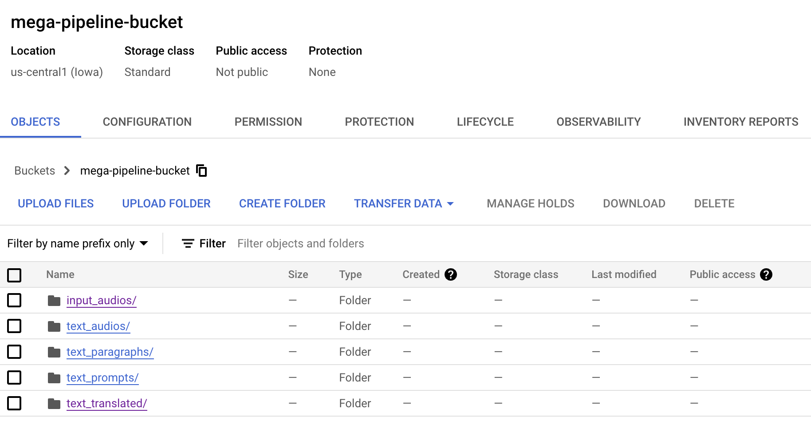

# Mega Pipeline App

🎙️ &rightarrow; 📝 &rightarrow; 🗒️ &rightarrow;  [🔊🇫🇷] &rightarrow; 🔊

In this tutorial app is to build a [Mega Pipeline App](https://ac215-mega-pipeline.dlops.io/) which does the following:

* Allows a user to Record audio using a mic
* The audio file is then transcribed using Google Cloud Speech to Text API
* The text is used as a prompt to a pre-trained GPT2 model to Generate Text (100 words)
* The generated text is synthesized to audio using Google Cloud Text-to-Speech API
* The generated text is also translated to Hindi using googletrans
* The translated text is then synthesized to audio using Google Cloud Text-to-Speech API

The pipeline flow is as shown:


## The class will work in teams:
* 📝Team A [transcribe_audio](https://github.com/dlops-io/mega-pipeline/tree/main/transcribe_audio):
* 🗒️Team B [generate_text](https://github.com/dlops-io/mega-pipeline/tree/main/generate_text):
* 🔊Team C [synthesis_audio_en](https://github.com/dlops-io/mega-pipeline/tree/main/synthesis_audio_en):
* 🇮🇳Team D [translate_text](https://github.com/dlops-io/mega-pipeline/tree/main/translate_text):
* 🔊Team E [synthesis_audio](https://github.com/dlops-io/mega-pipeline/tree/main/synthesis_audio):

Each team will create a Docker container to build the required functionality. The details on what to build in each container are linked above for each team.
The overall progress of this mega pipeline can be viewed [here](https://ac215-mega-pipeline.dlops.io/)

## GCP Credentials File:
Download the json file and place inside <app_folder>/secrets:
<a href="https://static.us.edusercontent.com/files/mlca0YEYdvkWPNEowJ0o4hOd" download>mega-pipeline.json</a>


## GCS Bucket Details:
* **input_audios** - Bucket where we store the input audio files
* **text_prompts** - Bucket where we store the text prompts that was synthesized by audio to text
* **text_paragraphs** - Bucket where we store the generated text from GPT2
* **text_translated** - Bucket where we store the translated text
* **text_audios** - Bucket where we store the audio of the paragraph of text
* **output_audios** - Bucket where we store the final Hindi audio files




### Resulting CLI options for each container

**Transcribe Audio**
```
python cli.py -d
python cli.py -t
python cli.py -u
```

**Generate Text**
```
python cli.py -d
python cli.py -g
python cli.py -u
```

**Synthesis Audio English**
```
python cli.py -d
python cli.py -s
python cli.py -u
```

**Translate Text**
```
python cli.py -d
python cli.py -t
python cli.py -u
```

**Synthesis Audio**
```
python cli.py -d
python cli.py -s
python cli.py -u
```


### Sample Code to Read/Write to GCS Bucket

* Download from bucket
```
from google.cloud import storage

# Initiate Storage client
storage_client = storage.Client(project=gcp_project)

# Get reference to bucket
bucket = storage_client.bucket(bucket_name)

# Find all content in a bucket
blobs = bucket.list_blobs(prefix="input_audios/")
for blob in blobs:
    print(blob.name)
    if not blob.name.endswith("/"):
        blob.download_to_filename(blob.name)

```

* Upload to bucket
```
from google.cloud import storage

# Initiate Storage client
storage_client = storage.Client(project=gcp_project)

# Get reference to bucket
bucket = storage_client.bucket(bucket_name)

# Destination path in GCS 
destination_blob_name = "input_audios/test.mp3"
blob = bucket.blob(destination_blob_name)

blob.upload_from_filename("Path to test.mp3 on local computer")

```

### Sample Dockerfile
```
# Use the official Debian-hosted Python image
FROM python:3.8-slim-buster

# Tell pipenv where the shell is. 
# This allows us to use "pipenv shell" as a container entry point.
ENV PYENV_SHELL=/bin/bash

ENV GOOGLE_APPLICATION_CREDENTIALS=secrets/mega-pipeline.json

# Ensure we have an up to date baseline, install dependencies 
RUN set -ex; \
    apt-get update && \
    apt-get upgrade -y && \
    apt-get install -y --no-install-recommends build-essential git ffmpeg && \
    pip install --no-cache-dir --upgrade pip && \
    pip install pipenv && \
    mkdir -p /app

WORKDIR /app

# Add Pipfile, Pipfile.lock
ADD Pipfile Pipfile.lock /app/

RUN pipenv sync

# Source code
ADD . /app

# Entry point
ENTRYPOINT ["/bin/bash"]

# Get into the pipenv shell
CMD ["-c", "pipenv shell"]
```

### Some notes for running on Windows
* Docker Win10 installation - needs WSL2 or Hyper-V enabled: https://docs.docker.com/desktop/windows/install/
* Use `Git` BASH to run (which is like a smaller `Cygwin`)
* Needed to add pwd in quotes in order to escape the spaces that common in windows directory structures
* Need to prefix docker run with `winpty` otherwise I get a "the input device is not a TTY." error
* `winpty docker run --rm -ti --mount type=bind,source="$(pwd)",target=/app generate_text`

## Solutions
Solutions to this tutorial can be found [here]()
